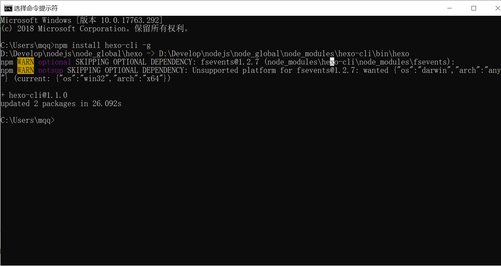

> &emsp;&emsp;一年又过去了，2019 年已经过了 2 个月了，想起自己从毕业至今已工作了差不多 2 年的时间，期间做了一个又一个项目，技术也学了不少，但是现在回想起来，很多记忆已经很模糊，看过的，学过的，做过的，都已不大记得清楚了，更别谈刻在脑海中。掌握一个技术性知识点的过程无非这三步：一是学习，可在博客、书籍、视频中学习；二是实践，学了没用上的知识是很快就会在脑海中消失的；三是分享，一些牛人都说过，不能说得让别人听懂的，证明自己还没理解透彻，想来是有一定道理的。基于以上三点，想来要在 2019 年掌握一些知识，是需要开始写一些博客做下分享了。写博客的目的，一来可以做一些学习中的必须，二来可以阶段性对某一个技术进行总结，三来我的分享要是有幸让别人受益，也算是做了一点贡献了。
>
> &emsp;&emsp;要写博客，首先要有一个博客，博客也无非 2 种，一种是注册现成的博客，如 CSDN、博客园、简书、SegmentFault、掘金、知乎等；一种是自己搭建博客，如 Hexo、WordPress 等。本文题目是 `Hexo + Github Pages 搭建个人博客` ，那么我的选择就肯定是 Hexo 了。至于这些博客的优劣，这里不会阐述。
>
> &emsp;&emsp;既然我的博客搭建起来了，想起搭建博客过程中的各种折腾各种坑，第一篇博客当然就是分享下个人博客的搭建过程啦！

### 一、准备工具

​        由于 Hexo 需要使用 nodejs 编译，git 上传，所以需要安装这 2 个工具。这里安装过程略过，只给出下载地址。

#### 1、安装 Node.js

- 下载地址：https://nodejs.org/zh-cn/
- 测试是否成功：命令行使用 `node -v` 和 `npm -v` ，查看显示版本号即成功。

#### 2、安装 Git

- 下载地址：https://git-scm.com/download
- 建议安装一个 Git 客户端，如：TortoiseGit

### 二、安装 Hexo

- 执行命令：`npm install hexo-cli -g`
  
- 创建存放博客的目录（如我的为 F:\Hexo\myblog）
- 初始化 Hexo 网站（比较漫长的等待）：`hexo init`
- 生成静态页面：`hexo g`
- 启动服务器：`hexo s`
- 访问博客：`http://localhost:4000/`

### 二、部署到 Github

&emsp;&emsp;完成上面的步骤之后，就可以在本地写写博客来玩了。但是我们既然写了博客，肯定是想要放到网上让别人看到的，要不然直接写到笔记软件里多好，不用折腾这么多。这里我选择使用 Github Pages 来部署我的博客。